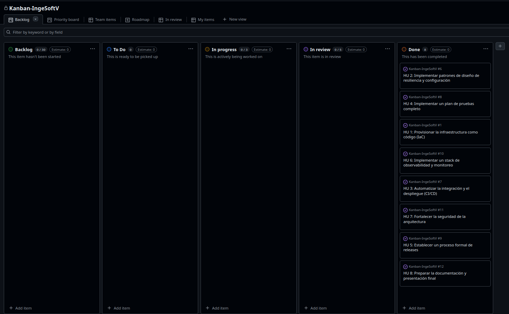

# Metodología Ágil - Proyecto E-Commerce Microservices

## Resumen Ejecutivo

El proyecto fue desarrollado utilizando metodología ágil basada en **Kanban**, con un enfoque en la entrega continua de valor y la colaboración entre los miembros del equipo. Se utilizó un tablero Kanban en **GitHub Projects** para gestionar el flujo de trabajo y visualizar el progreso de las tareas.

## Estrategia de Ramas (Git Flow)

Se implementó una estrategia de ramas basada en **Git Flow**, utilizando tres tipos principales de ramas:

### Ramas Principales

- **`main`**: Rama de producción que contiene el código estable y desplegado en el entorno de producción. Solo se actualiza mediante Pull Requests (PR) desde `develop` después de code review y aprobación.

- **`develop`**: Rama de desarrollo que integra todas las funcionalidades completadas. Es la rama base para el entorno de desarrollo y recibe los merges de las ramas `feature`.

- **`feature/*`**: Ramas de características individuales creadas desde `develop` para implementar funcionalidades específicas. Cada historia de usuario (HU) se desarrolla en su propia rama feature siguiendo la convención `feature/nombre-de-la-funcionalidad`.

### Flujo de Trabajo con Ramas

```
develop (base)
    ↓
feature/hu-1 (desarrollo)
    ↓
Pull Request → develop (code review)
    ↓
develop (integración)
    ↓
Pull Request → main (release)
    ↓
main (producción)
```

## Metodología Kanban

Se adoptó **Kanban** como metodología ágil para gestionar el trabajo del proyecto. Esta metodología permitió:

- **Visualización del flujo de trabajo**: Todas las tareas fueron organizadas en un tablero Kanban visible para todo el equipo.
- **Limitación del trabajo en progreso (WIP)**: Se establecieron límites para evitar la sobrecarga y mantener el foco.
- **Mejora continua**: El flujo de trabajo se optimizó continuamente basándose en las métricas del tablero.
- **Transparencia**: El estado de cada tarea era visible en tiempo real para todos los miembros del equipo.

### Tablero Kanban en GitHub Projects

Se utilizó **GitHub Projects** como herramienta para gestionar el tablero Kanban. El tablero incluía las siguientes columnas típicas:

- **Backlog**: Historias de usuario y tareas pendientes de iniciar.
- **To Do**: Tareas listas para ser trabajadas.
- **In Progress**: Tareas actualmente en desarrollo.
- **In Review**: Tareas completadas esperando revisión de código.
- **Done**: Tareas completadas y desplegadas.



## Historias de Usuario (HU)

El proyecto se dividió en **8 historias de usuario** que fueron distribuidas entre los miembros del equipo para su implementación. Cada historia de usuario representaba una funcionalidad completa y entregable del sistema.

### Lista de Historias de Usuario

1. **HU-1**: *Provisionar la infraestructura como código (IaC)*
   - **Responsable**: *Santiago Valencia + Pablo Fernando Pineda*
   - **Estado**: *Completada*

2. **HU-2**: *Implementar patrones de diseño de resiliencia y configuración*
   - **Responsable**: *Pablo Fernando Pineda*
   - **Estado**: *Completada*

3. **HU-3**: *Automatizar la integración y el despliegue (CI/CD)*
   - **Responsable**: *Santiago Valencia*
   - **Estado**: *Completada*

4. **HU-4**: *Implementar un plan de pruebas completo*
   - **Responsable**: *Pablo Fernando Pineda*
   - **Estado**: *Completada*

5. **HU-5**: *Establecer un proceso formal de releases*
   - **Responsable**: *Santiago Valencia*
   - **Estado**: *Completada*

6. **HU-6**: *Implementar un stack de observabilidad y monitoreo*
   - **Responsable**: *Pablo Fernando Pineda*
   - **Estado**: *Completada*

7. **HU-7**: *Fortalecer la seguridad de la arquitectura*
   - **Responsable**: *Pablo Fernando Pineda*
   - **Estado**: *Completada*

8. **HU-8**: *Preparar la documentación y presentación final*
   - **Responsable**: *Santiago Valencia + Pablo Fernando Pineda*
   - **Estado**: *Completada*

## Proceso de Desarrollo

### 1. Planificación

- Las historias de usuario fueron priorizadas y agregadas al tablero Kanban.
- Cada historia fue asignada a un desarrollador según su disponibilidad y expertise.
- Se creó una rama `feature` desde `develop` para cada historia de usuario.

### 2. Desarrollo

- Cada desarrollador trabajó en su rama `feature` de forma independiente.
- Se realizaron commits frecuentes siguiendo convenciones de mensajes (Conventional Commits).
- El código se desarrolló siguiendo los estándares y patrones definidos en el proyecto.

### 3. Code Review y Integración

- Al completar una historia de usuario, se creó un Pull Request desde la rama `feature` hacia `develop`.
- Se realizó code review antes de aprobar el merge.
- Una vez aprobado el Pull Request, se realizó el merge a `develop`, completando así la integración de la funcionalidad.

## Ventajas de la Metodología Implementada

- **Flexibilidad**: Permitió adaptarse a cambios en los requisitos durante el desarrollo.
- **Transparencia**: El tablero Kanban proporcionó visibilidad completa del estado del proyecto.
- **Colaboración**: Facilitó la comunicación y coordinación entre los miembros del equipo.
- **Calidad**: El proceso de code review aseguró la calidad del código antes de integrarlo.
- **Organización**: La estrategia de ramas permitió trabajar de forma paralela sin conflictos.

## Herramientas Utilizadas

- **GitHub**: Control de versiones y gestión de código.
- **GitHub Projects**: Tablero Kanban para gestión de tareas.
- **Pull Requests**: Revisión de código y colaboración.
- **Branches**: Estrategia de ramas para organización del trabajo.

## Conclusiones

La implementación de metodología ágil basada en Kanban, combinada con una estrategia de ramas clara, permitió desarrollar el proyecto de manera eficiente, manteniendo la calidad del código y facilitando la colaboración entre los miembros del equipo. El uso de GitHub Projects como tablero Kanban proporcionó la visibilidad necesaria para gestionar el progreso de las 8 historias de usuario de forma efectiva.

