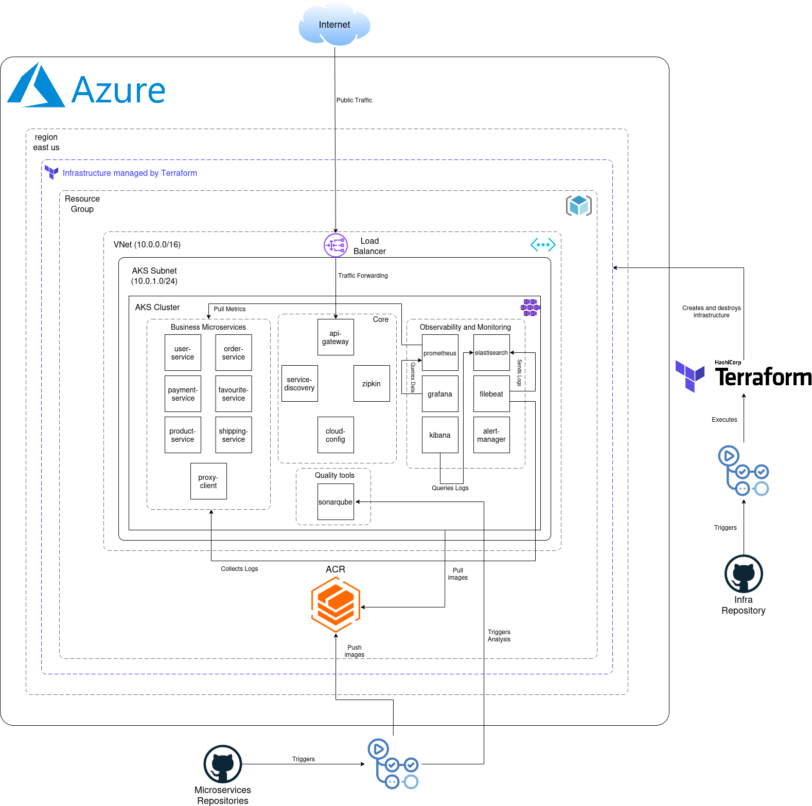

# Diagrama de Arquitectura del Sistema

Este documento describe la arquitectura completa del sistema de microservicios de e-commerce desplegado en Microsoft Azure. La arquitectura se mantiene consistente tanto para el entorno de desarrollo como para producción, diferenciándose únicamente en los tamaños de recursos y configuraciones de escalabilidad.

## Visión General

El sistema se implementa utilizando una arquitectura de microservicios desplegada en Azure Kubernetes Service (AKS), con infraestructura gestionada mediante Terraform como código. La arquitectura sigue principios de alta disponibilidad, escalabilidad horizontal y observabilidad integral.

## Componentes Principales

### Capa de Infraestructura Cloud

#### Azure Resource Group
El proyecto organiza todos los recursos dentro de un grupo de recursos dedicado en Azure. Este grupo de recursos actúa como contenedor lógico que facilita la gestión, el control de accesos y el seguimiento de costos de todos los componentes desplegados.

#### Red Virtual (VNet)
Se configura una red virtual con el espacio de direcciones `10.0.0.0/16`, proporcionando aislamiento de red y seguridad para todos los servicios. La VNet incluye subredes específicas para diferentes propósitos:

- **AKS Subnet (`10.0.1.0/24`)**: Subred dedicada para los nodos del clúster de Kubernetes, garantizando el aislamiento de red de los pods y servicios.

#### Azure Container Registry (ACR)
El ACR almacena todas las imágenes Docker de los microservicios. Se configura con un Private Endpoint para garantizar que las comunicaciones entre AKS y ACR permanezcan dentro de la red privada de Azure, mejorando la seguridad y reduciendo la latencia. El clúster AKS se autentica automáticamente con ACR mediante roles de Azure, eliminando la necesidad de credenciales explícitas.

### Clúster de Kubernetes (AKS)

El Azure Kubernetes Service orquesta todos los contenedores del sistema. El clúster se despliega dentro de la subred AKS y maneja el ciclo de vida completo de los microservicios.

#### API Gateway y Balanceo de Carga

El API Gateway actúa como punto de entrada único al sistema, implementando el patrón Gateway Aggregation. Este componente:

- Recibe el tráfico público a través de un Load Balancer de Azure
- Implementa enrutamiento inteligente hacia los microservicios internos
- Proporciona funcionalidades transversales como circuit breaking, retry policies y timeouts
- Integra trazabilidad distribuida mediante Spring Cloud Sleuth

El tráfico fluye desde Internet hacia el Load Balancer público, que distribuye las peticiones al API Gateway. Desde allí, las solicitudes se enrutan a los microservicios correspondientes basándose en las reglas de routing configuradas.

#### Servicios Core

Los servicios core proporcionan funcionalidades esenciales de infraestructura:

**Service Discovery (Eureka)**
Implementa el patrón de descubrimiento de servicios, permitiendo que los microservicios se registren automáticamente y se descubran dinámicamente sin configuración estática de URLs. Todos los microservicios de negocio se registran como clientes Eureka al iniciar, manteniendo su estado mediante heartbeats periódicos.

**Cloud Config Server**
Centraliza la configuración de todos los microservicios, permitiendo la gestión de configuraciones por entorno sin necesidad de recompilar o redesplegar aplicaciones. Soporta perfiles múltiples y actualización dinámica de propiedades.

**Zipkin**
Servidor de trazabilidad distribuida que recolecta y visualiza traces de todas las transacciones que atraviesan múltiples microservicios. Facilita el debugging y análisis de performance en arquitecturas distribuidas.

#### Microservicios de Negocio

Los microservicios de negocio implementan las capacidades funcionales del sistema:

**User Service**
Gestiona el dominio de usuarios, incluyendo autenticación, perfiles de usuario y direcciones de envío. Mantiene su propia base de datos independiente siguiendo el patrón Database per Service.

**Order Service**
Administra el ciclo de vida completo de las órdenes de compra, desde la creación del carrito hasta la confirmación del pedido. Coordina con otros servicios para validar disponibilidad de productos y procesar pagos.

**Payment Service**
Procesa las transacciones de pago asociadas a las órdenes. Implementa patrones de resiliencia como circuit breaker para manejar fallos en servicios de pago externos.

**Product Service**
Mantiene el catálogo de productos, categorías e inventario. Proporciona APIs para búsqueda y filtrado de productos.

**Shipping Service**
Gestiona la información de envío y tracking de los pedidos. Se integra con servicios de logística para proporcionar actualizaciones de estado.

**Favourite Service**
Permite a los usuarios gestionar listas de productos favoritos, proporcionando persistencia y sincronización de preferencias.

#### Servicios Auxiliares

**Proxy Client**
Cliente web que actúa como interfaz de usuario, consumiendo los servicios backend a través del API Gateway. Implementa el patrón Backend for Frontend (BFF).

**SonarQube**
Plataforma de inspección continua de calidad de código. Se despliega dentro del clúster junto con su base de datos PostgreSQL dedicada. Analiza el código fuente en cada integración continua, proporcionando métricas de calidad, cobertura de pruebas y detección de vulnerabilidades.

**Grafana**
Herramienta de visualización y monitoreo que consume métricas de los microservicios y del clúster de Kubernetes. Proporciona dashboards interactivos para observabilidad operacional.

### Capa de Observabilidad y Monitoreo

El sistema implementa observabilidad completa mediante tres pilares fundamentales:

**Trazabilidad Distribuida**
Zipkin recolecta traces de todas las interacciones entre microservicios, permitiendo visualizar el flujo completo de las peticiones y identificar cuellos de botella.

**Métricas y Monitoreo**
Grafana centraliza la visualización de métricas de aplicación y de infraestructura, proporcionando alertas proactivas sobre anomalías.

**Análisis de Calidad**
SonarQube analiza continuamente el código fuente, identificando code smells, bugs potenciales y vulnerabilidades de seguridad.

## Gestión de Infraestructura como Código

### Terraform

Toda la infraestructura de Azure se gestiona mediante Terraform, permitiendo despliegues reproducibles y versionados. Los recursos se organizan en módulos reutilizables:

- Módulo de Resource Group
- Módulo de Networking (VNet y subredes)
- Módulo de Azure Container Registry
- Módulo de Azure Kubernetes Service

El estado de Terraform se almacena remotamente en Azure Storage Account, permitiendo colaboración entre equipos y manteniendo un registro histórico de cambios.

### Repositorios y CI/CD

Los repositorios de código fuente se almacenan en GitHub, implementando una estrategia de monorepo que facilita la gestión de dependencias compartidas. Los workflows de GitHub Actions se activan automáticamente ante cambios en el código:

1. Se ejecutan pruebas unitarias e integración
2. Se realiza análisis de código estático con SonarQube
3. Se construyen las imágenes Docker
4. Se suben las imágenes al Azure Container Registry
5. Se actualizan los deployments de Kubernetes

Este flujo automatizado garantiza que solo código validado y de calidad llegue a los entornos desplegados.

## Comunicación entre Componentes

### Comunicación Síncrona

Los microservicios se comunican principalmente mediante HTTP REST, utilizando el API Gateway como punto de entrada. La comunicación interna entre servicios utiliza Service Discovery para resolver dinámicamente las ubicaciones de los servicios.

### Balanceo de Carga

Kubernetes proporciona balanceo de carga nativo mediante Services, distribuyendo el tráfico entre múltiples réplicas de cada microservicio. El API Gateway implementa adicionalmente client-side load balancing mediante Spring Cloud LoadBalancer.

### Resiliencia

El sistema implementa múltiples patrones de resiliencia:

- Circuit Breaker: Previene fallos en cascada aislando servicios problemáticos
- Retry: Reintenta operaciones fallidas con backoff exponencial
- Timeout: Limita el tiempo de espera de operaciones
- Bulkhead: Aísla pools de recursos para prevenir agotamiento

## Seguridad

### Aislamiento de Red

La arquitectura implementa múltiples capas de seguridad de red:

- El ACR utiliza Private Endpoint, manteniendo el tráfico de imágenes dentro de la red privada
- Los microservicios solo son accesibles a través del API Gateway
- El clúster AKS se despliega en una subred dedicada

### Autenticación y Autorización

El sistema utiliza roles de Azure (RBAC) para controlar el acceso a recursos. La integración entre AKS y ACR se realiza mediante Managed Identity, eliminando la necesidad de credenciales almacenadas.

## Escalabilidad

### Escalabilidad Horizontal

Cada microservicio puede escalar independientemente mediante réplicas de pods en Kubernetes. El Horizontal Pod Autoscaler ajusta automáticamente el número de réplicas basándose en métricas de CPU y memoria.

### Escalabilidad de Infraestructura

El clúster AKS soporta nodos adicionales mediante node pools configurables. La arquitectura permite agregar capacidad de cómputo sin modificar las aplicaciones desplegadas.

## Consistencia entre Entornos

La arquitectura descrita se aplica tanto para el entorno de desarrollo como para producción. Las diferencias radican únicamente en:

- Tamaño de las instancias de máquinas virtuales
- Número de réplicas de pods
- Configuraciones específicas de aplicación (endpoints, credenciales)
- Políticas de escalado automático

Esta consistencia entre entornos reduce significativamente los riesgos asociados con diferencias de configuración entre desarrollo y producción, facilitando la detección temprana de problemas y mejorando la predictibilidad de los despliegues.
