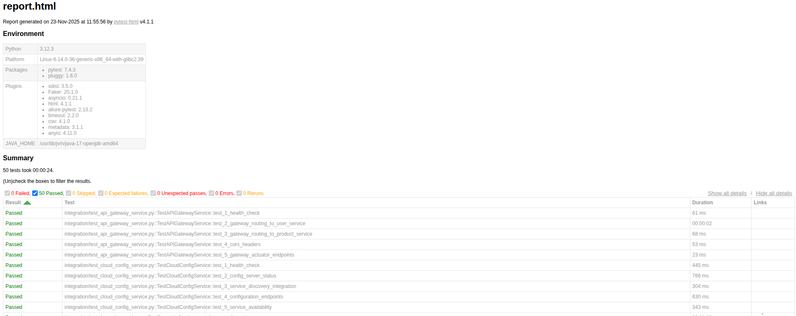
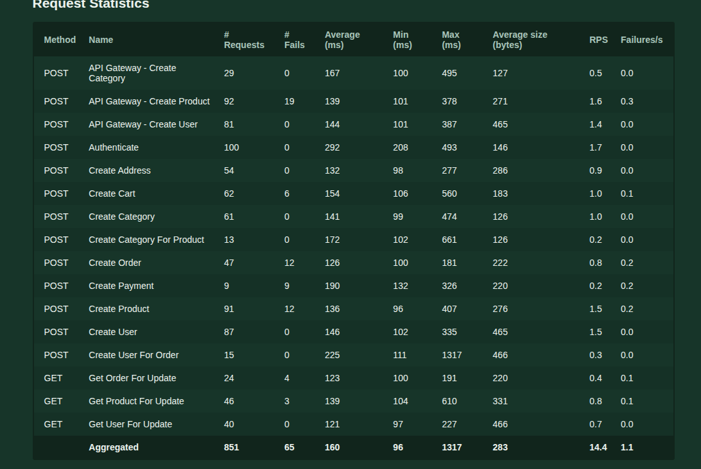
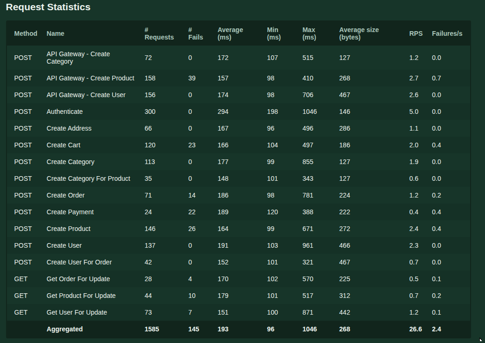
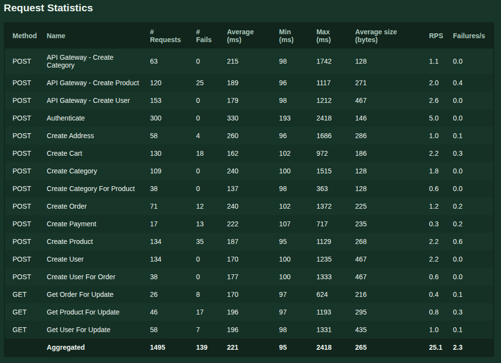
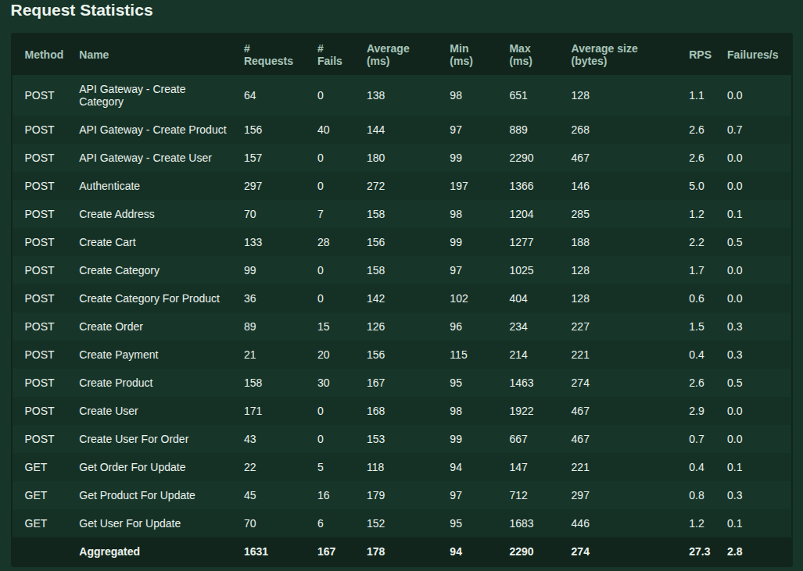
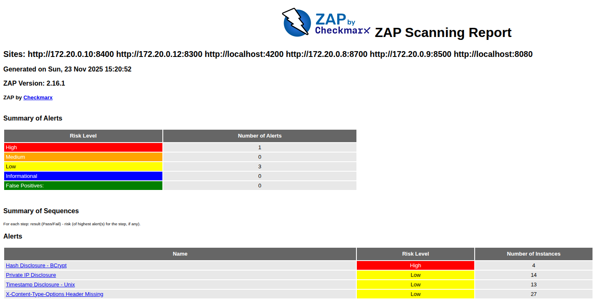

## Análisis de resultados de pruebas

Este apartado resume, de forma cualitativa, los resultados de las pruebas realizadas sobre la plataforma de microservicios, poniendo el foco en qué se validó, cómo se validó y qué grado de confianza aportan las pruebas sobre el comportamiento del sistema.

### Alcance general de las pruebas

- **Servicios cubiertos**: todos los servicios de backend incluyen pruebas automatizadas, con foco especial en la lógica de negocio y en la integración con servicios externos.
- **Tipos de pruebas**:
  - **Pruebas unitarias** sobre servicios de dominio y capas de negocio.
  - **Pruebas de integración** en servicios clave que validan la lógica de extremo a extremo.
  - **Pruebas manuales sobre el entorno desplegado**, apoyadas en los endpoints de salud y en los dashboards de observabilidad para validar el comportamiento del sistema.

De forma resumida, dichos reportes muestran que:

- **Las suites de pruebas unitarias e integración se ejecutan correctamente**, sin fallos en los casos críticos definidos, lo que indica que la lógica de negocio principal y los flujos de integración contemplados se comportan según lo esperado.
- **Las pruebas de rendimiento no detectaron cuellos de botella graves** en los escenarios ejecutados, aunque sí ponen de manifiesto que, para cargas reales de producción, sería necesario ampliar la campaña de pruebas y ajustar parámetros de escalado en Kubernetes.
- **Las pruebas de seguridad no identificaron vulnerabilidades evidentes en la configuración revisada**, pero señalan claramente que el alcance es limitado y que en un entorno productivo deben añadirse análisis de seguridad más profundos.

El análisis presente en este documento se apoya en estos resultados para ofrecer una visión global y coherente de la calidad y el comportamiento de la plataforma.

### Pruebas unitarias

En los servicios de backend se dispone de pruebas unitarias que validan la lógica de negocio de forma aislada, simulando dependencias externas para garantizar que cada componente funciona correctamente de manera independiente.

- **Cobertura funcional**:
  - Validación de operaciones básicas de negocio (creación, lectura, actualización, eliminación) sobre entidades principales del sistema.
  - Verificación de reglas de negocio (por ejemplo, manejo de carritos activos/inactivos, validación de entradas y tratamiento de errores).
  - Comprobación de que los servicios manejan adecuadamente entradas inválidas o datos inexistentes.
- **Conclusión de análisis**:
  - Las pruebas unitarias se centran en los casos más relevantes de la lógica de negocio.
  - Permiten validar el comportamiento esperado sin depender de servicios externos ni de la infraestructura.
  - Aportan un buen nivel de confianza sobre el correcto funcionamiento de la lógica interna de los servicios.

**Resultados observables en reportes**  

Los reportes de cobertura HTML (`tests/reports/coverage/index.html`) muestran una **cobertura global aproximada del 42 %**, concentrada en los módulos más críticos del sistema. Aunque no se cubre el 100 % del código, la cobertura se focaliza en las rutas de negocio principales.

### Pruebas End-to-End (E2E)

Las pruebas end-to-end validan flujos completos de usuario a través de múltiples servicios, simulando el comportamiento real de un usuario final del sistema.

- **Alcance**:
  - Se ejecutaron **35 pruebas E2E** en total, distribuidas en **5 pruebas para cada servicio de negocio**:
    - User Service (5 pruebas)
    - Product Service (5 pruebas)
    - Order Service (5 pruebas)
    - Payment Service (5 pruebas)
    - Shipping Service (5 pruebas)
    - Favourite Service (5 pruebas)
    - Proxy Service (5 pruebas)
  - Cada conjunto de pruebas valida operaciones CRUD completas y flujos de negocio específicos de cada servicio.
- **Conclusión de análisis**:
  - Las pruebas E2E confirman que los flujos completos de usuario funcionan correctamente a través del API Gateway.
  - Se valida la integración entre servicios y el comportamiento del sistema desde la perspectiva del usuario final.

**Resultados observables en reportes**

El reporte de pruebas E2E muestra el total de pruebas ejecutadas y el número de pruebas que pasaron exitosamente.

### Pruebas de integración

Las pruebas de integración validan la funcionalidad de cada servicio individualmente, incluyendo tanto servicios de negocio como servicios core de infraestructura.

- **Alcance**:
  - Se ejecutaron **50 pruebas de integración** en total, que incluyen:
    - **Servicios de negocio**: User Service, Product Service, Order Service, Payment Service, Shipping Service, Favourite Service, Proxy Service
    - **Servicios core**: API Gateway, Cloud Config, Service Discovery
  - Cada servicio tiene pruebas que validan operaciones CRUD, health checks y funcionalidades específicas del dominio.
- **Conclusión de análisis**:
  - Estas pruebas confirman que cada servicio funciona correctamente de forma individual.
  - Se valida la integración entre la lógica de negocio y los servicios externos, así como el comportamiento de los servicios de infraestructura.

**Resultados observables en reportes**

En el reporte de pruebas de integración se resumen **50 pruebas pasadas, 0 fallidas y 0 omitidas**, lo que indica que todos los escenarios de integración definidos se ejecutaron correctamente.

### Pruebas de rendimiento (performance)

Las pruebas de rendimiento se ejecutaron sobre el sistema desplegado en Azure Kubernetes Service (AKS), accediendo a los servicios a través del API Gateway. Se evaluó el comportamiento del sistema bajo diferentes niveles de carga concurrente: 100, 500, 1000 y 2000 usuarios virtuales, durante 60 segundos cada prueba.

- **Aspectos validados**:
  - Capacidad de los microservicios para atender múltiples peticiones concurrentes sin errores ni tiempos de respuesta excesivos.
  - Comportamiento del sistema cuando se incrementa progresivamente la carga (pruebas de estrés).
  - Throughput (RPS - Requests Per Second) bajo diferentes niveles de carga.
  - Tasa de éxito y degradación del rendimiento bajo carga extrema.

**Hallazgos principales:**

1. **Capacidad máxima identificada: ~26-27 RPS**
   - El sistema alcanza su máximo throughput alrededor de 500-1000 usuarios. Más usuarios no aumentan el RPS; aumentan la latencia y los fallos.

2. **Resiliencia demostrada: tasa de éxito >89% bajo carga extrema**
   - Con 2000 usuarios (20x la carga inicial), la tasa de éxito se mantiene en 89.76%, con una degradación controlada de solo 2.6 puntos porcentuales respecto a 100 usuarios.

3. **Punto óptimo de operación: 500-1000 usuarios**
   - El sistema escala bien hasta ~500 usuarios, pero después de ese punto requiere escalado horizontal para aumentar capacidad.

4. **Tiempos de respuesta aceptables bajo todas las cargas**
   - Los tiempos promedio se mantienen entre 160-221ms en todos los escenarios, cumpliendo con estándares adecuados para aplicaciones ecommerce.

5. **Comportamiento estable bajo saturación**
   - Aunque el RPS se estanca después de 500 usuarios, el sistema mantiene rendimiento predecible y no colapsa, demostrando que los mecanismos de protección funcionan correctamente.

**Resultados observables en reportes**

Los reportes de rendimiento muestran métricas detalladas para cada nivel de carga evaluado (100, 500, 1000 y 2000 usuarios concurrentes).

### Pruebas de seguridad

Las pruebas de seguridad realizadas también estuvieron centradas principalmente en la **aplicación y la configuración**, no en ejercicios avanzados sobre el clúster de Kubernetes.

**Resultados observables en reportes**

El reporte de seguridad resume los hallazgos con la siguiente distribución de riesgo:

Se identificaron **4 tipos de vulnerabilidades**:

| Vulnerabilidad | Severidad | Instancias |
|----------------|-----------|------------|
| Hash Disclosure - BCrypt | High | 4 |
| Private IP Disclosure | Low | 14 |
| Timestamp Disclosure - Unix | Low | 13 |
| X-Content-Type-Options Header Missing | Low | 27 |

- **1 alerta de riesgo Alto (High)**: relacionada con *Hash Disclosure - BCrypt*, que indica exposición de información sobre hashes y sirve como recordatorio de reforzar la gestión de credenciales en entornos reales.
- **0 alertas de riesgo Medio (Medium)**.
- **3 alertas de riesgo Bajo (Low)**: incluyendo *Private IP Disclosure*, *Timestamp Disclosure - Unix* y *X-Content-Type-Options Header Missing*, hallazgos informativos típicos de entornos de desarrollo.

Estos resultados confirman que, aunque no se han detectado vulnerabilidades críticas explotables en el contexto de los tests, sí existen aspectos a endurecer de cara a un despliegue productivo.

